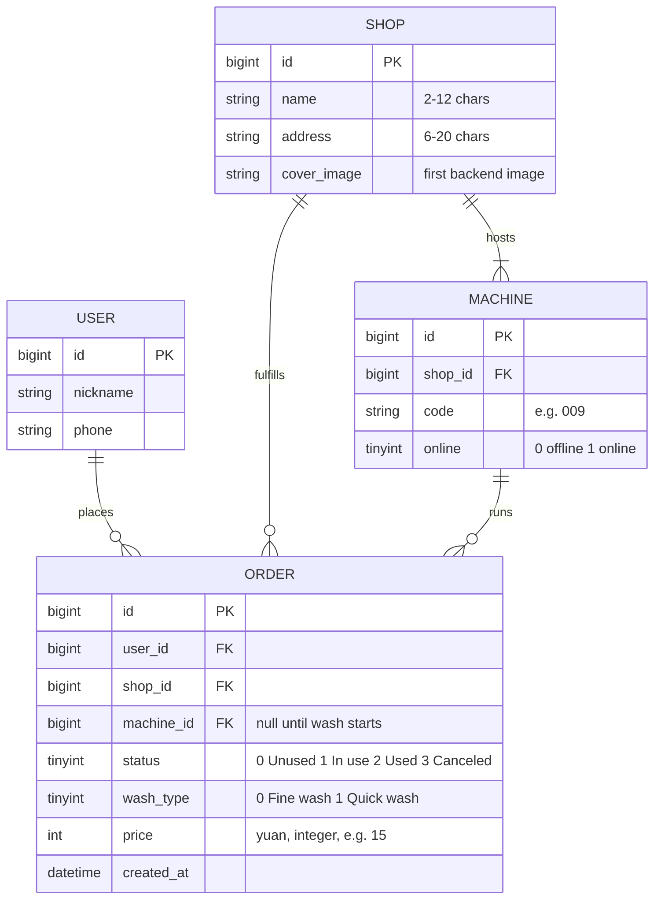
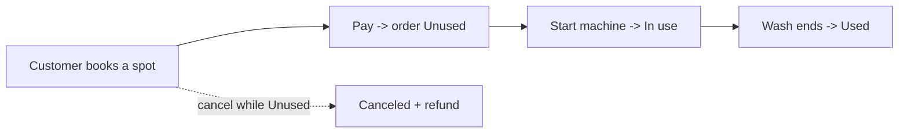
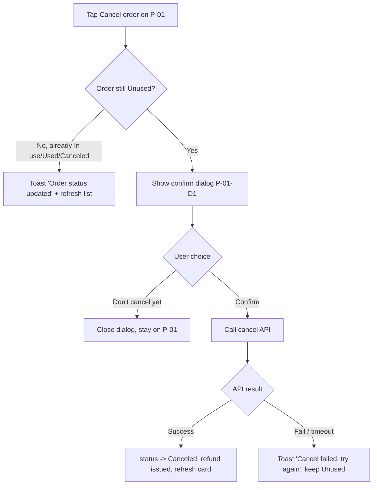
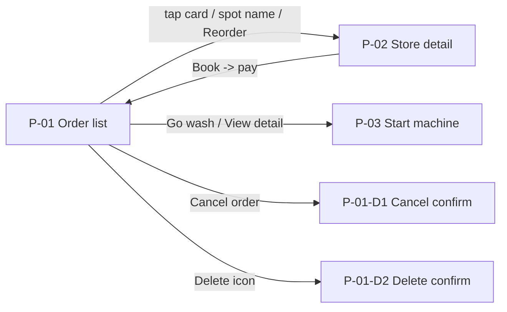
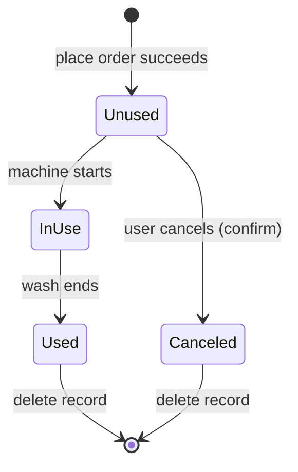

# Car-Wash App — Order Center (Order List + Store Detail)

> Owner: Jordan Wei | Version: v1.3 | Last updated: 2026-07-11

---

## 1. Product & feature intro

- **Who am I**: a self-service car-wash booking app. Users find a nearby car-wash spot, book a wash, pay, then start the wash machine from their phone.
- **What am I good for**: this iteration reworks the **Order Center** — the "Orders" tab where a user tracks every wash they booked, cancels one they no longer need, jumps back into an active wash, or re-books a spot they liked.
- **Why this iteration**: the old order list showed a flat, time-sorted list with no status grouping, so users lost track of the wash they were about to start. v1.3 groups by order status, adds the cancel/reorder/delete actions inline, and wires the list straight into the start-machine flow.
- **Target users**: **Customer** (car owner) is the primary role. **Shop staff** and **Ops** touch the same order data through the back office (permissions are specced below) but are out of scope for the app screens here.
- **Core use scenario**: a user opens the **Orders** tab, sees their bookings grouped as *Unused / In use / Used*, taps **Go wash** on an unused order to start machine 009, or taps **Cancel order** on a booking they no longer need.

> Scope note: this is a **version iteration**, so per the skill's tailoring guidance the *Industry overview* section is dropped and the *Product intro* is trimmed to what a new engineer needs to start building.

---

## 2. Version v1.3

### 2.1 Schedule

| Module | Owner | Est. start | Est. finish | Status |
|--------|-------|-----------|-------------|--------|
| P-01 Order list (grouping + inline actions) | Client — Amy Lin | 2026-07-14 | 2026-07-25 | In progress |
| P-02 Store detail (reorder entry) | Client — Amy Lin | 2026-07-21 | 2026-07-30 | Not started |
| Order-state service (cancel / delete API) | Backend — Ravi Menon | 2026-07-14 | 2026-07-24 | In progress |
| Start-machine bridge (P-03 hand-off) | Backend — Ravi Menon | 2026-07-25 | 2026-08-01 | Not started |
| Analytics events (order_* funnel) | Data — Sofia Park | 2026-07-28 | 2026-08-04 | Not started |
| QA regression + edge-path pass | QA — Deng Hua | 2026-08-04 | 2026-08-11 | Not started |

### 2.2 Product design

#### 2.2.1 Entity-Relationship (E-R) diagram

The Order Center persists four entities. A **User** places many **Orders**; each Order targets exactly one **Shop** (car-wash spot) and, once the wash starts, is bound to one **Machine** at that shop.

> Enum meaning is spelled out in the diagram so backend and QA never have to guess: `status` 0/1/2/3 = Unused / In use / Used / Canceled; `wash_type` 0/1 = Fine wash / Quick wash.

#### 2.2.2 Role-permission matrix

Three roles touch order data. The app screens in this PRD are the **Customer** column; Shop staff and Ops act through the back office and are listed so the backend builds one consistent permission layer.

| Function / Data | Customer | Shop staff | Ops |
|-----------------|:--------:|:----------:|:---:|
| View order list | Own orders only | Own shop's orders | All orders |
| View order detail | Own only | Own shop | Yes |
| Cancel order | Own, only while **Unused** | No | Yes (any state, with reason) |
| Delete order record | Own, only **Used / Canceled** | No | No (soft-hide only) |
| Start wash machine | Own, only **Unused** | Assist at kiosk | No |
| Reorder (re-book a spot) | Yes | No | No |
| Issue refund on cancel | Auto (system) | No | Yes (manual override) |

#### 2.2.3 Flowcharts (decomposed layer by layer)

**Business flow** (the whole booking-to-wash loop):

**Task flow — "Cancel order"** (every branch, including the abort path):

**Page flow** (how the Order Center screens transition):

#### 2.2.4 Global spec (shared controls & states — defined once, referenced everywhere)

Defined here once; the per-page specs below reference these by name instead of re-describing them.

| Scenario | Behavior | Copy / action |
|----------|----------|---------------|
| Empty data | Centered illustration + hint + primary button | "No orders yet — find a spot to wash" + [Find a spot] → P-02 discovery |
| Loading (first load) | Full-page skeleton of 3 card placeholders | — |
| Loading more (pagination) | Bottom spinner row | "Loading…" |
| Load failed / server error | Centered illustration + retry, **previous data kept if any** | "Load failed, tap to retry" + [Retry] |
| Offline | Top sticky banner (non-blocking) | "No network connection" |
| No permission / not logged in | Redirect to login; on return, restore intended page | — |
| Request in flight (any action button) | Button shows spinner + disabled | Prevents double submit |
| Destructive confirm | Center modal, 2 buttons, primary = safe choice | See P-01-D1 / P-01-D2 |
| Toast | Bottom toast, auto-dismiss 2s | Short single line |

---

## 3. Function & interaction spec

> Every page and dialog carries a **number** (P-01, P-02, P-01-D1 …) so the doc, the wireframes, and the visual designs all line up. This is the heart of the PRD — specced, not summarized.

### P-01 — Order list ("Orders" tab) ⭐

**Wireframe context.** Page titled **"Orders"**. Each order is a card showing the **cover image**, **spot name** (e.g. "Hengjiang Building"), **detailed address**, **wash type**, **price** (e.g. ¥25 / ¥15), and a **status label** (Unused / In use / Used). Cards carry inline action buttons — **Cancel order**, **Go wash**, **View detail**, **Reorder** — depending on status, plus a **delete (trash) icon** on finished orders. A bottom tab bar shows **Home / Orders / Mine**. The numbered call-outs (1)–(6) below match the annotations drawn on the wireframe.

#### (1) Field spec

| Field | Description | Data source |
|-------|-------------|-------------|
| Order date | Format: `2016-03-15 19:00` | System-determined |
| Order status | Unused / In use / Used / Canceled | System-determined |
| Car-wash spot name | 2–12 characters | Backend |
| Detailed address | 6–20 characters; single line only; if it overflows one line, the last character shows as "…" | Backend |
| Image | The first image uploaded in the backend | Backend |
| Wash type | Fine wash / Quick wash | System-determined |
| Price | e.g. ¥15, integer | Backend |

#### (2) Condition spec

| Precondition | Sort rule | Load rule |
|--------------|-----------|-----------|
| User is logged in | 1. Sort by order status first (Unused, In use, Used); 2. Then reverse chronological order (newest first) within each status group | 1. Auto-load on entering the page; 2. Load 10 historical orders per batch, pull up to load more; 3. Silent refresh of a single card when returning from P-02 / P-03; 4. Pull-to-refresh reloads from the first batch |

> Canceled orders are not pinned into the status grouping — they fall to the bottom in reverse-chronological order and carry the delete icon.

#### (3) Order state transitions

State table:

| From state | Trigger / condition | To state |
|------------|---------------------|----------|
| (none) | User places order successfully | Unused |
| Unused | Wash machine starts successfully | In use |
| In use | Wash ends | Used |
| Unused | User cancels order (confirmed in P-01-D1) | Canceled |

State diagram:

> Only **Unused** can move to **Canceled** — once a wash has started (In use) or finished (Used), cancel is no longer offered; the card exposes *View detail* / *Reorder* instead.

#### (4) Interactions — numbered to the wireframe annotations (normal + abnormal)

Normal-path interactions, keyed to the call-outs drawn on the page:

1. **(1) Tap the order card / spot name** → enter the store detail page **P-02** (store 008).
2. **(2) Tap "Cancel order"** → pop confirm dialog **P-01-D1** "Are you sure you want to cancel this order?"; tap **"Confirm"** → cancel the order (status → Canceled, refund issued), refresh the card in place; tap **"Don't cancel yet"** → close the dialog and return to this page.
3. **(3) Tap "Go wash"** → enter the start-machine page **P-03** (machine 009).
4. **(4) Tap "View detail"** → enter the start-machine page **P-03** (machine 009).
5. **(5) Tap the delete (trash) icon** → pop confirm dialog **P-01-D2** "Are you sure you want to delete this order?"; tap **"Confirm"** → delete the order (removed from the list); tap **"Cancel"** → close the dialog and return to this page.
6. **(6) Tap "Reorder"** → enter the store detail page **P-02** (store 008).

Which actions appear on a card, by status:

| Status | Buttons shown | Delete icon? |
|--------|---------------|:------------:|
| Unused | Cancel order · Go wash | No |
| In use | View detail | No |
| Used | Reorder · View detail | Yes |
| Canceled | Reorder | Yes |

**Abnormal / edge paths** — the part that stops the back-and-forth. Structured as element × action:

| # | Element / trigger | Action | Normal result | Abnormal / edge handling |
|---|-------------------|--------|---------------|--------------------------|
| A1 | Page open, no orders | Enter Orders tab | List renders | List empty → show [Global spec · Empty data] with [Find a spot]; do not show an error |
| A2 | First load | Fetch order list | 10 cards render | Fetch fails/timeout → [Global spec · Load failed]; on retry keep any previously shown data, don't blank the screen |
| A3 | Offline | Enter or refresh | — | Show [Global spec · Offline] banner; keep cached list read-only; action buttons stay tappable but a tap surfaces "No network connection" toast and makes no state change |
| A4 | (2) Cancel order | Tap on an order that another device already moved to In use | — | Skip the dialog; toast "Order status updated" and silent-refresh that card to In use (order already changed elsewhere) |
| A5 | (2) Cancel order | Confirm in P-01-D1, API fails | — | Toast "Cancel failed, please try again"; card stays Unused; no refund side-effect |
| A6 | (2) Cancel order | Double-tap "Cancel order" / double-tap "Confirm" | — | Button enters loading+disabled on first tap ([Global spec · Request in flight]); second tap ignored; cancel API is idempotent on the order id |
| A7 | (3)(4) Go wash / View detail | Tap when machine 009 is offline / occupied | View detail opens P-03 (read-only) | **Go wash** pre-checks the machine: server returns `MACHINE_OFFLINE` / `MACHINE_BUSY` → show dialog "This machine is currently unavailable. Try again shortly." with [Refresh]; do **not** navigate to P-03. **View detail** still opens P-03 regardless (no live start needed) |
| A8 | (5) Delete | Confirm delete, API fails | — | Toast "Delete failed, please try again"; card remains in the list |
| A9 | (6) Reorder | Tap when shop 008 is closed / delisted | — | Toast "This spot is no longer available"; stay on P-01; do not navigate to a dead P-02 |
| A10 | Session | Any action after the login token expired | — | Redirect to login ([Global spec · No permission]); after re-login, return to P-01 and replay the tapped action's target screen (not the mutation) |
| A11 | Pagination | Repeated pull-up while a "load more" request is in flight | — | Ignore new load-more requests until the current one resolves; show the bottom spinner only once |
| A12 | Pull-to-refresh | Pull down repeatedly | Reload batch 1 | Ignore new refresh while one is in flight; on success reset to the first 10 and re-apply the sort rule |
| A13 | Boundary | Only 1 order exists / last page reached | Render | Single card renders with no grouping headers dropped; at the last page show "No more orders" footer instead of the load-more spinner |
| A14 | Concurrency | Order auto-completes (In use → Used) while the user stares at the list | — | On next silent refresh or pull-to-refresh, the card re-sorts into the Used group and swaps its buttons to Reorder · View detail + delete icon |

#### P-01-D1 — Cancel-order confirm dialog

- **Trigger**: (2) tap "Cancel order" on an **Unused** card.
- **Title / body**: "Are you sure you want to cancel this order?"
- **Buttons**: **Confirm** (destructive) → call cancel API, on success status → Canceled and refund is issued automatically; **Don't cancel yet** (safe, default-highlighted) → close, no change.
- **Abnormal**: while the Confirm request is in flight the button is loading+disabled (A6); on failure see A5; if the order was already moved off Unused before Confirm, see A4.

#### P-01-D2 — Delete-order confirm dialog

- **Trigger**: (5) tap the delete (trash) icon on a **Used** or **Canceled** card.
- **Title / body**: "Are you sure you want to delete this order?"
- **Buttons**: **Confirm** (destructive) → delete the order, remove the card from the list; **Cancel** (safe) → close, no change.
- **Abnormal**: on API failure see A8; delete is a soft-hide on the backend (Ops still retains the record per the permission matrix) but the user sees it gone.

---

### P-02 — Store detail

The spot a user lands on from (1) / (6). Specced more briefly with the same canonical tables — it re-books a wash, feeding a new **Unused** order back to P-01.

#### Field spec

| Field | Description | Data source |
|-------|-------------|-------------|
| Spot name | 2–12 characters | Backend |
| Detailed address | 6–20 characters; single line, overflow shows "…" | Backend |
| Image gallery | All backend-uploaded images, first as cover | Backend |
| Business hours | Format: `08:00–22:00`; if closed now, show "Closed" tag | Backend |
| Distance | e.g. `1.2 km`; computed from user location and shop geo | Computed |
| Wash type + price | Fine wash ¥25 / Quick wash ¥15, integer | Backend |
| Availability | Idle machine count, e.g. "3 machines free" | API `GET /shops/008/machines` → free_count |

#### Condition spec

| Precondition | Sort rule | Load rule |
|--------------|-----------|-----------|
| Reached from P-01 (card / Reorder) or from search; login not required to view, required to book | Wash-type options sorted Fine wash then Quick wash | Load shop detail on entry; refresh availability every 30s while page is foregrounded |

#### State (booking) transition

| From state | Trigger / condition | To state |
|------------|---------------------|----------|
| Viewing | Tap "Book" while logged out | Redirect to login, return to P-02 |
| Viewing | Tap "Book" + pick wash type + pay success | New order created → **Unused** (appears on P-01) |
| Viewing | Shop shows 0 free machines | "Book" disabled with "No machine free right now" |

#### Interactions (normal + abnormal)

- **Normal**: tap a wash type → highlight + show its price; tap **Book** → go to pay; pay success → toast "Booked" and return to P-01 with the new Unused order pinned on top of its group.
- **Abnormal**:
  - Shop delisted/closed on open → show a closed state, disable Book (mirrors P-01 A9).
  - Availability drops to 0 between load and Book tap → block with "No machine free right now", re-fetch availability.
  - Pay fails/cancelled → stay on P-02, no order created, toast "Payment not completed".
  - Offline → [Global spec · Offline]; Book disabled until network returns.

> **P-03 — Start machine** (machine 009) is the hand-off target of (3)/(4). It is owned by the *Start-machine bridge* module in the schedule and specced in its own PRD; P-01 only needs to route to it and pass `order_id` + `machine_id`.

---

## 4. Non-functional requirements

### 4.1 Event-tracking (analytics)

| Event | Trigger timing | Properties | Notes |
|-------|----------------|------------|-------|
| `order_list_view` | P-01 finishes first render | `order_count`, `unused_count`, `source` (tab/deeplink) | Page-view rate for the Orders tab |
| `order_card_click` | (1) tap card / spot name | `order_id`, `status`, `position` | Feeds the list→detail funnel |
| `order_cancel_click` | (2) tap "Cancel order" | `order_id` | Top of the cancel funnel |
| `order_cancel_confirm` | P-01-D1 Confirm tapped | `order_id`, `result` (success/fail) | Cancel completion & failure rate |
| `order_go_wash_click` | (3) tap "Go wash" | `order_id`, `machine_id` | Core conversion: booking → wash |
| `order_reorder_click` | (6) tap "Reorder" | `order_id`, `shop_id` | Repeat-purchase signal |
| `order_delete_confirm` | P-01-D2 Confirm tapped | `order_id`, `result` | Delete completion rate |
| `store_detail_book_click` | P-02 tap "Book" | `shop_id`, `wash_type`, `price` | Rebook funnel from P-02 |

### 4.2 Performance

- P-01 first meaningful paint ≤ **1.5s** on a 4G connection; skeleton shown within 300ms.
- Order-list API p95 latency ≤ **500ms** for a 10-item batch; pagination request ≤ **400ms**.
- Cancel / delete actions give optimistic UI feedback within **100ms** (spinner) and reconcile on API return.
- List renders smoothly (≥ 55 FPS scroll) up to **500** cached orders; beyond that, older batches are windowed/recycled.

### 4.3 Compatibility

- **iOS** 14+ and **Android** 9+ (API 28+).
- Phone form factor is primary; tablet renders the same single-column list centered at max width 640px.
- Handles safe-area insets (notch / home indicator); the bottom tab bar (Home / Orders / Mine) stays above the gesture bar.
- Right-to-left locales mirror the layout; the address "…" overflow truncation flips accordingly.

---

## 5. Change log

| Version | Date | Author | Change |
|---------|------|--------|--------|
| v1.3 | 2026-07-11 | Jordan Wei | Order Center rework: status-grouped P-01, inline Cancel/Go-wash/View-detail/Reorder + delete, P-01-D1/D2 confirm dialogs, full abnormal-path table, P-02 rebook entry. |
| v1.2 | 2026-06-02 | Jordan Wei | Added silent single-card refresh on return from detail; introduced global offline banner. |
| v1.1 | 2026-04-18 | Amy Lin | First inline "Cancel order" action on the flat, time-sorted list (pre-grouping). |
| v1.0 | 2026-03-15 | Jordan Wei | Initial Order list: flat reverse-chronological list, tap-through to store detail only. |
