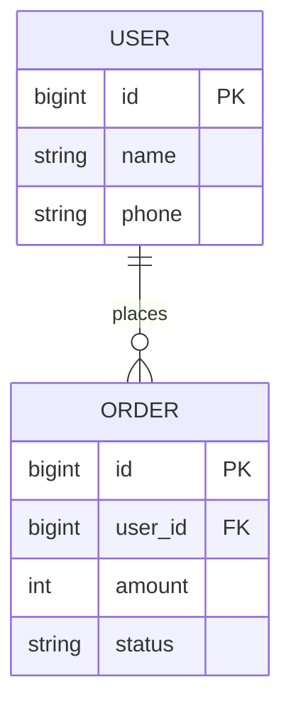
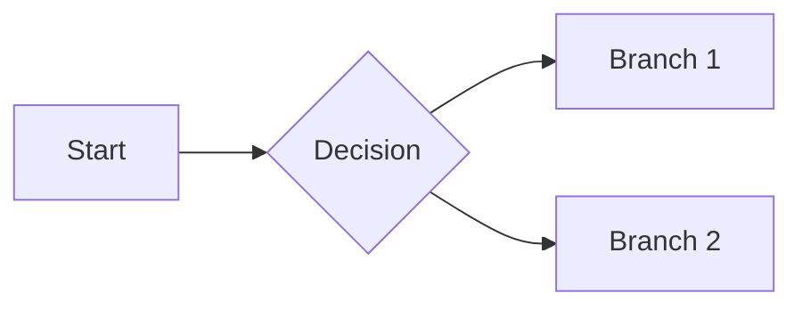

> **This is the lightweight alternative, not the default.** Use it only when the user explicitly asked for Markdown,
> or when the change is a single-screen tweak with no UI surface to annotate. The default deliverable of this skill is
> a single self-contained **annotated HTML PRD** — start from `assets/annotated-html-prd-template.html` and follow
> `references/annotated-html-mockups.md`. If the spec needs an annotated mockup, a `.spec` block, a pill, or a marker,
> it needs the HTML format instead: this Markdown path and its renderer cannot carry any of them.
>
> **>>> LANGUAGE <<<** — this skeleton is written in English only because it has to be written in *some* language.
> **Write the document in the user's language**, not in this template's. Translate every section heading and hint
> below (`Product intro` → `产品简介`, `Industry overview` → `行业与业务背景`, `Who am I` → `我是谁`, and so on) to
> match the language of the user's request and of their existing PRD corpus. Keep product names, metric names,
> entity names, and code identifiers in their original English — only the connective prose is translated. Pass the
> matching `--lang` when you render: `python3 scripts/prd_to_html.py prd.md -o prd.html --lang zh-CN`.

---

# <Product Name> — Product Requirements Document (PRD)

> Owner: ____ | Version: v____ | Last updated: YYYY-MM-DD
> <!-- How to use: lines in <!-- --> are hints; delete them once filled. For iterations / small requests, delete whole sections you don't need. -->

---

## 1. Product intro

- **Who am I**: <!-- Positioning in one or two sentences, e.g. an inventory SaaS for small merchants. -->
- **What am I good for**: <!-- What it does, what service it offers, what problem it solves. -->
- **Why choose us**: <!-- Differentiators versus competitors. -->
- **Target users**: <!-- Who uses it, which roles. -->
- **Core use scenario**: <!-- In what situation they use it and what they need to accomplish. -->

## 2. Industry overview <!-- Brand-new product / proposal only; delete for iterations -->

- Current state:
- Trends:
- Competitor analysis: <!-- Main competitors + where we stand -->

---

## 3. Version v____

### 3.1 Schedule

| Module | Owner | Est. start | Est. finish | Status |
|--------|-------|-----------|-------------|--------|
|  |  |  |  | Not started / In progress / Done |

### 3.2 Product design

#### 3.2.1 Entity-Relationship (E-R) diagram <!-- Only when data is persisted -->

<!-- Describe entities, attribute fields, and relationships with Mermaid or prose -->

#### 3.2.2 Role-permission matrix <!-- Only when multiple roles/permissions exist -->

| Function / Data | Admin | Member | Guest |
|-----------------|:-----:|:------:|:-----:|
| View list | Yes | Yes | No |
| Create | Yes | Yes | No |
| Delete | Yes | No | No |

#### 3.2.3 Flowcharts

**Business flow** (overall logic):

**Task flow / page flow**: <!-- Decompose to task level and page-transition level as needed -->

#### 3.2.4 Global spec (shared controls & states, defined once)

| Scenario | Behavior | Copy / action |
|----------|----------|---------------|
| Empty data |  |  |
| Loading |  |  |
| Load failed / network error |  | <!-- e.g. show "Load failed, tap to retry" --> |
| No permission |  |  |
| Button loading / disabled |  |  |

#### 3.2.5 Function & interaction spec

> Number every page/module (P-01, P-02, ...) and write all four dimensions.

##### P-01 <Page / Function Name>

**(1) Fields, descriptions, data sources**

| Field | Description | Data source |
|-------|-------------|-------------|
|  | <!-- type / format / length / enum values / display rules, e.g. "6-20 chars, single line, overflow shows ..." --> | <!-- System-determined / Backend / API endpoint->field / Computed / User input --> |

**(2) Precondition, sort rule, load rule**

| Precondition | Sort rule | Load rule |
|--------------|-----------|-----------|
| <!-- e.g. user logged in --> | <!-- e.g. by status, then reverse chronological --> | <!-- first-load + pagination/"load more" + refresh --> |

**(3) State transitions**

| From state | Trigger / condition | To state |
|------------|---------------------|----------|
|  |  |  |

**(4) Interactions (numbered to the wireframe annotations; cover normal + abnormal)**

- (1) Tap <element> → <result>
- (2) Tap <element> → pop confirm dialog "<question>"; "Confirm" → <action>; "Cancel/Back" → return to this page
- (3) ...
- Abnormal paths: <!-- empty / load failure / offline / invalid input / over-limit / no-permission / concurrency (e.g. order already changed) / double-tap; how each is handled -->

#### 3.2.6 Page annotations

Number every mockup / visual to match the page numbers above, so the spec and the screen line up.

**If you are filling this section in, you are probably in the wrong format.** A pixel-faithful, numbered mockup that
lives *inside* the doc — rather than behind a link to a design tool — is the annotated-mockup triad, and Markdown
cannot render it. Switch to `assets/annotated-html-prd-template.html` and `references/annotated-html-mockups.md`.
Keep this section in Markdown only when the page annotations are links out to an external design file.

### 3.3 Non-functional requirements

#### Event-tracking (analytics)

| Tracking location | Event name | Trigger timing | Reported params |
|-------------------|-----------|----------------|-----------------|
|  |  |  |  |

#### Performance

<!-- Response time, concurrency, data volume; write "no special requirement" if none -->

#### Compatibility

<!-- OS versions, device types (phone/tablet/PC), browser range -->

### 3.4 Change log

| Version | Date | Author | Change |
|---------|------|--------|--------|
| v____ | YYYY-MM-DD |  | Initial draft |
