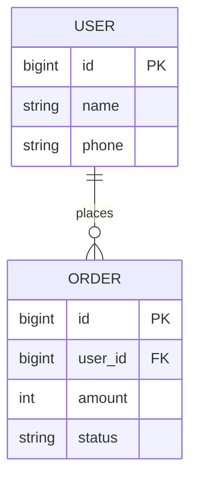
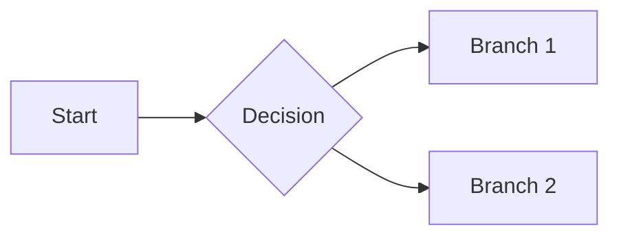

# <Product Name> — Product Requirements Document (PRD)

> Owner: ____ | Version: v____ | Last updated: YYYY-MM-DD
> <!-- How to use: lines in <!-- --> are hints; delete them once filled. For iterations / small requests, delete whole sections you don't need. -->

---

## 1. Product intro

- **Who am I**: <!-- Positioning in one or two sentences, e.g. an inventory SaaS for small merchants. -->
- **What am I good for**: <!-- What it does, what service it offers, what problem it solves. -->
- **Why choose us**: <!-- Differentiators versus competitors. -->
- **Target users**: <!-- Who uses it, which roles. -->
- **Core use scenario**: <!-- In what situation they use it and what they need to accomplish. -->

## 2. Industry overview <!-- Brand-new product / proposal only; delete for iterations -->

- Current state:
- Trends:
- Competitor analysis: <!-- Main competitors + where we stand -->

---

## 3. Version v____

### 3.1 Schedule

| Module | Owner | Est. start | Est. finish | Status |
|--------|-------|-----------|-------------|--------|
|  |  |  |  | Not started / In progress / Done |

### 3.2 Product design

#### 3.2.1 Entity-Relationship (E-R) diagram <!-- Only when data is persisted -->

<!-- Describe entities, attribute fields, and relationships with Mermaid or prose -->

#### 3.2.2 Role-permission matrix <!-- Only when multiple roles/permissions exist -->

| Function / Data | Admin | Member | Guest |
|-----------------|:-----:|:------:|:-----:|
| View list | Yes | Yes | No |
| Create | Yes | Yes | No |
| Delete | Yes | No | No |

#### 3.2.3 Flowcharts

**Business flow** (overall logic):

**Task flow / page flow**: <!-- Decompose to task level and page-transition level as needed -->

#### 3.2.4 Global spec (shared controls & states, defined once)

| Scenario | Behavior | Copy / action |
|----------|----------|---------------|
| Empty data |  |  |
| Loading |  |  |
| Load failed / network error |  | <!-- e.g. show "Load failed, tap to retry" --> |
| No permission |  |  |
| Button loading / disabled |  |  |

#### 3.2.5 Function & interaction spec

> Number every page/module (P-01, P-02, ...) and write all four dimensions.

##### P-01 <Page / Function Name>

**(1) Fields, descriptions, data sources**

| Field | Description | Data source |
|-------|-------------|-------------|
|  | <!-- type / format / length / enum values / display rules, e.g. "6-20 chars, single line, overflow shows ..." --> | <!-- System-determined / Backend / API endpoint->field / Computed / User input --> |

**(2) Precondition, sort rule, load rule**

| Precondition | Sort rule | Load rule |
|--------------|-----------|-----------|
| <!-- e.g. user logged in --> | <!-- e.g. by status, then reverse chronological --> | <!-- first-load + pagination/"load more" + refresh --> |

**(3) State transitions**

| From state | Trigger / condition | To state |
|------------|---------------------|----------|
|  |  |  |

**(4) Interactions (numbered to the wireframe annotations; cover normal + abnormal)**

- (1) Tap <element> → <result>
- (2) Tap <element> → pop confirm dialog "<question>"; "Confirm" → <action>; "Cancel/Back" → return to this page
- (3) ...
- Abnormal paths: <!-- empty / load failure / offline / invalid input / over-limit / no-permission / concurrency (e.g. order already changed) / double-tap; how each is handled -->

#### 3.2.6 Page annotations

<!-- Number every mockup / visual, matching the P-01/P-02 above, so all three line up.
     To put a pixel-faithful, numbered mockup *inside* the doc (not a link to an external design tool),
     use the annotated-mockup triad — see references/annotated-html-mockups.md and
     assets/annotated-html-prd-template.html. -->

### 3.3 Non-functional requirements

#### Event-tracking (analytics)

| Tracking location | Event name | Trigger timing | Reported params |
|-------------------|-----------|----------------|-----------------|
|  |  |  |  |

#### Performance

<!-- Response time, concurrency, data volume; write "no special requirement" if none -->

#### Compatibility

<!-- OS versions, device types (phone/tablet/PC), browser range -->

### 3.4 Change log

| Version | Date | Author | Change |
|---------|------|--------|--------|
| v____ | YYYY-MM-DD |  | Initial draft |
