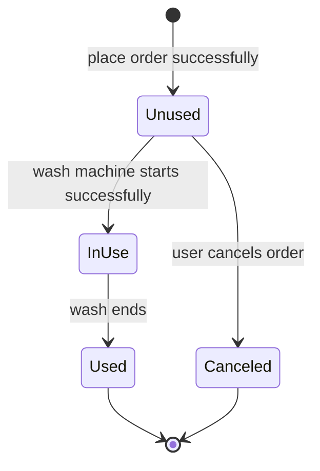
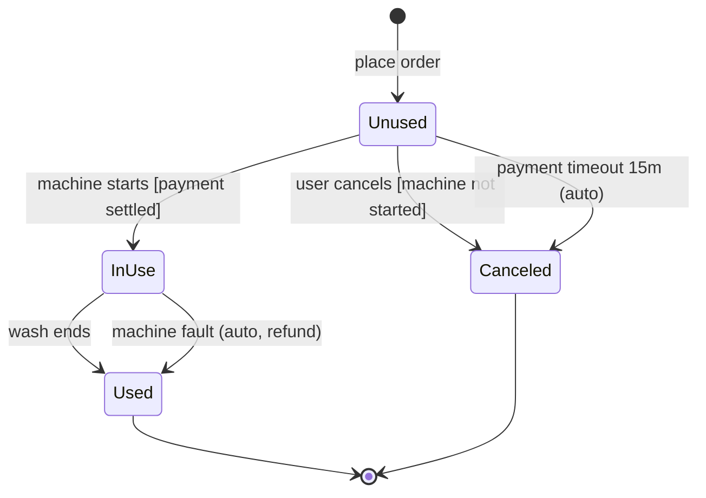

# Function & Interaction Spec — the exhaustive method

> This is the deep-dive for the **Requirements, function & interaction spec** (section 3.2.5 of the PRD). It is
> deliberately the most detailed part of the whole skill. `references/section-guide.md` is the *summary* of the whole
> product-design section; **this file is the exhaustive method** for the function spec specifically. The two never
> contradict — where the summary says "write the four dimensions," this file shows you how to fill every column of every
> table, the full abnormal-path taxonomy, per-component interaction conventions, permissions and analytics per action,
> acceptance criteria, and a fully worked max-detail example.
>
> Running example throughout: a **car-wash booking app** (order list, store detail, start-machine). Every table below
> is filled with realistic values from that app so you can copy the shapes directly.

---

# PART A — The article's method, reproduced faithfully

## A1. Why this section is the heart of the PRD

Everything else in the PRD — the E-R diagram, the role matrix, the flowcharts — exists to *set up* this section. The
function & interaction spec is where an engineer finally learns exactly what to build on each screen: which fields
appear, where their data comes from, what state each object is in, and what happens on every tap. If this section is
vague, the whole PRD is vague, and QA discovers it. If this section is complete, an engineer can estimate and build
with almost no follow-up questions.

**The self-check for every chunk you write:** *if I were the engineer, would I still need to come back and ask?* If the
answer is yes, you have not finished the sentence. Write the answer to that question directly into the spec. "Show the
address" is a question generator (how long? what if it overflows? where does it come from?). "Address, 6-20 characters,
single line, overflow truncates with `...`, from Backend" is an answer.

## A2. Slice each page into regions, then components

Before writing tables, decompose the page top-to-bottom into regions, and each region into components:

- **Navigation region** — title bar, back button, page title, right-side actions.
- **Content region** — the list, form, cards, detail blocks; the meat of the page.
- **Action region** — primary/secondary buttons, floating action buttons.
- **Global chrome** — bottom tab bar, toasts, dialogs (mostly defined once in the global spec; reference, don't repeat).

Then, for each component, ask the four dimensions (below). A "page" in the spec is one numbered screen; a large screen
may decompose into several components each with its own field table.

## A3. Every page carries a number

Give every page/mockup a **number** — `P-01`, `P-02`, `P-03` ... — and use that number in the spec heading, in every
cross-reference ("tap the card → go to store detail **P-02**"), and on the wireframe itself. This is what makes the
document, the mockups, and the visual designs line up so nobody has to guess which screen a paragraph is about. The
interaction list is keyed to numbered annotations `(1)`, `(2)`, `(3)` ... drawn on the wireframe, so each rule points at
an exact element on the picture.

The running example uses:

| Page # | Page | Key objects |
|--------|------|-------------|
| P-01 | Order list | orders (store 008, machine 009) |
| P-02 | Store detail | store 008 |
| P-03 | Start-machine | machine 009 |

## A4. The four dimensions (with the canonical formats)

Every page/module is written across the same four dimensions. Use these exact table shapes everywhere so all pages line
up and reviewers can scan them fast.

### (i) Fields, descriptions, data sources

| Field | Description | Data source |
|-------|-------------|-------------|

The **Description** cell packs everything about the field into one place — type, format, length, enum values, and
display rules — exactly like the article's *"6-20 characters; single line only; if it overflows one line, the last
character shows as `...`"*. The **Data source** cell is one of: **System-determined** / **Backend** / **User input** /
**Computed** / **API `<endpoint> -> <field>`**.

### (ii) Precondition, sort rule, load rule

| Precondition | Sort rule | Load rule |
|--------------|-----------|-----------|

**Precondition** = what must hold to enter the page / trigger the function. **Sort rule** = the ordering of the list.
**Load rule** folds in first-load, pagination ("load more"), and refresh behavior in one cell.

### (iii) State transitions

| From state | Trigger / condition | To state |
|------------|---------------------|----------|

Add a Mermaid `stateDiagram-v2` whenever it clarifies the machine.

### (iv) Interactions (normal + abnormal)

A **numbered list keyed to the wireframe annotations** — `(1)`, `(2)`, `(3)` ... matching the numbers drawn on the
page. Each line reads: *tap/act on `<element>` → `<result>`*. It must cover **normal and abnormal** operations —
confirm dialogs, cancel/back branches, and errors. For complex pages you may additionally give a structured table:

| # | Element | Action | Normal result | Abnormal / edge handling |
|---|---------|--------|---------------|--------------------------|

---

## A5. The anchor example — Order list (P-01), faithfully reproduced

This is the article's worked example. Keep it faithful; everything in Part B builds on top of it.

**Wireframe context.** Page titled "Orders". Each card shows the car-wash spot name (e.g. "Hengjiang Building"), the
detailed address, the price (¥25 / ¥15), and a status label (Unused / In use / Used). Action buttons per card: **Cancel
order** / **Go wash** / **View detail** / **Reorder**. A delete (trash) icon appears on used orders. A bottom tab bar
shows Home / Orders / Mine. Every page carries a number so the doc lines up with the visuals — this one is **P-01**.

### (i) Field spec

| Field | Description | Data source |
|-------|-------------|-------------|
| Order date | Format: `2016-03-15 19:00` | System-determined |
| Order status | Unused / In use / Used / Canceled | System-determined |
| Car-wash spot name | 2-12 characters | Backend |
| Detailed address | 6-20 characters; single line only; if it overflows one line, the last character shows as `...` | Backend |
| Image | The first image uploaded in the backend | Backend |
| Wash type | Fine wash / Quick wash | System-determined |
| Price | e.g. ¥15, integer | Backend |

### (ii) Precondition, sort rule, load rule

| Precondition | Sort rule | Load rule |
|--------------|-----------|-----------|
| User is logged in | 1. Sort by order status first (Unused, In use, Used); 2. Then reverse chronological order | 1. Auto-load on entering the page; 2. Load 10 historical orders per batch, pull up to load more |

### (iii) Order state transitions

| From state | Trigger / condition | To state |
|------------|---------------------|----------|
| — | User places order successfully | Unused |
| Unused | Wash machine starts successfully | In use |
| In use | Wash ends | Used |
| Unused | User cancels order | Canceled |



### (iv) Interactions (numbered to the wireframe annotations)

1. Tap the order card / spot name → enter the store detail page (store 008, **P-02**).
2. Tap **Cancel order** → pop a confirm dialog "Are you sure you want to cancel this order?"; tap **Confirm** → cancel
   the order; tap **Don't cancel yet** → return to this page.
3. Tap **Go wash** → enter the start-machine page (machine 009, **P-03**).
4. Tap **View detail** → enter the start-machine page (machine 009, **P-03**).
5. Tap the delete (trash) icon → pop a confirm dialog "Are you sure you want to delete this order?"; tap **Confirm** →
   delete the order; tap **Cancel** → return to this page.
6. Tap **Reorder** → enter the store detail page (store 008, **P-02**).

That is the article's complete P-01. Part B goes deeper on every one of these while staying on the same app.

---

# PART B — Going deeper (the "most detailed" layer)

Everything below is built *on top of* the four-dimension format above. It never replaces the canonical tables — it
tells you how to fill them exhaustively.

## B1. Filling each field column richly

### B1.1 The Description cell — a packing checklist

The single Description cell should answer, in order, whatever applies:

1. **Type** — string / integer / decimal / boolean / enum / timestamp / image / money.
2. **Format** — the exact rendered shape (`2016-03-15 19:00`, `¥15`, `13800001111`).
3. **Length / range** — min-max characters, min-max value, decimal places.
4. **Enum dictionary** — the full closed set of allowed values, spelled out.
5. **Display rules** — truncation, rounding, placeholder when empty, pluralization.
6. **Conditional visibility** — when the field shows or hides.
7. **Validation** — client-side and server-side rules (see B1.3).
8. **Masking** — for sensitive data (see B1.5).

Worked field rows for the car-wash app, richer than the anchor table:

| Field | Description | Data source |
|-------|-------------|-------------|
| Order status | Enum, System-determined: `Unused` / `In use` / `Used` / `Canceled`. Rendered as a colored pill: Unused = orange, In use = green, Used = grey, Canceled = grey with strikethrough card title. Never blank — if backend returns an unknown value, fall back to `Used` styling and log. | API `GET /orders -> items[].status` |
| Detailed address | String, 6-20 chars, single line only; overflow truncates the last visible glyph to `...`. Empty → show "Address not provided" in grey. Not tappable. | API `GET /orders -> items[].address` |
| Price | Money, integer CNY, rendered `¥{n}` (e.g. `¥15`, `¥25`). No decimals. Range 1-999. If `promo_price` present, show `promo_price` in orange with the original struck through. | API `GET /orders -> items[].price` (+ `promo_price`) |
| Image | Image URL; use the first image uploaded in backend. Rendered 72×72 rounded 8px. While loading show skeleton; on error show the default spot placeholder. | API `GET /orders -> items[].images[0]` |
| Wash type | Enum, System-determined: `Fine wash` / `Quick wash`. Shown as a tag next to the price. | API `GET /orders -> items[].washType` |
| Distance | Computed on client from user GPS and spot lat/lng; `<1km` shows as `{m}m`, else `{n.n}km`. Hidden if location permission denied. | Computed (client) |
| Order date | Timestamp, System-determined, format `YYYY-MM-DD HH:mm` in the **user's local timezone**; backend stores UTC. | API `GET /orders -> items[].createdAt` (UTC) |

### B1.2 Data-source notation

Always attribute every field to exactly one source so nobody guesses where a value comes from:

- **System-determined** — the app/business logic sets it (status, wash type dictionaries).
- **Backend** — configured in the admin/back-office (spot name, address, images, price).
- **API `<endpoint> -> <field>`** — the precise wire location; prefer this over bare "Backend" whenever you know the
  endpoint, so backend and client agree on the contract.
- **Computed** — derived on the client from other data (distance from GPS, "3 orders" counts, relative time).
- **User input** — typed/selected by the user (a note field, a coupon code).

When one field blends sources, say so: "Price = `promo_price` if present else `price` (API), rendered client-side."

### B1.3 Validation — client and server

For any editable or actionable field, state both layers; they are not the same and engineers need both:

- **Client validation** — instant feedback, format/length/required checks, disables submit. Example (coupon code
  field on P-02): "8 alphanumeric chars, uppercase-forced; submit disabled until 8 chars entered."
- **Server validation** — the source of truth, re-checks everything and owns business rules the client can't know.
  Example: "server verifies the coupon exists, is unexpired, unused, and applies to store 008; on failure returns a
  code the client maps to inline copy."

Table the mapping so error copy is not invented at build time:

| Server error code | Meaning | Inline copy shown |
|-------------------|---------|-------------------|
| `COUPON_NOT_FOUND` | Code doesn't exist | "This code isn't valid." |
| `COUPON_EXPIRED` | Past validity window | "This code has expired." |
| `COUPON_USED` | Already redeemed | "This code has already been used." |
| `COUPON_SCOPE` | Not valid for this store | "This code doesn't apply to this spot." |

### B1.4 Units, timezone, and format rules

State these once per doc in the global spec, and reference them per field:

- **Money** — integer CNY, symbol `¥`, no decimals in this app; thousands separator not used below ¥1000.
- **Time** — store UTC, display in device-local timezone; list uses `YYYY-MM-DD HH:mm`, detail may use relative
  ("2 hours ago") under 24h then absolute.
- **Distance** — metric; `<1km` in meters, else one decimal km.

### B1.5 Sensitive-data masking

Never render full sensitive values. In this app, the only PII is the user's phone on the Mine page and (rarely) an
order contact:

| Field | Masked display | Full value available |
|-------|----------------|----------------------|
| Phone | `138****1111` | Only server-side; never returned in full to the list API |
| Payment method | `**** 6411` | Never; card data never touches the client |

### B1.6 Microcopy & i18n

- Keep enum labels as keys, not literals, so they localize (`status.unused` → "Unused"). Never concatenate translated
  fragments; use whole templated strings (`"{n} orders"` not `"orders" + n`).
- Reserve room for longer languages; the address truncation rule must survive translation.
- Empty/placeholder copy is part of the spec, not a build-time afterthought — write it in the field row.

## B2. Load & refresh in depth

The single "Load rule" cell in the canonical table expands into these behaviors. Spell out each that applies.

| Behavior | Rule for P-01 (Order list) |
|----------|----------------------------|
| First load | Auto-load on entering the page. Show a full-page skeleton of 3 card placeholders until first batch returns. |
| Page size | 10 orders per batch. |
| Pagination ("load more") | Infinite scroll: when the user scrolls within 200px of the bottom, request the next batch. Show a bottom spinner row while fetching; show "No more orders" when the last page returns fewer than 10. |
| Pull-to-refresh | Pull down past 64px → refresh from page 1, replacing the list. Spinner in the nav area. |
| Silent refresh on return | When returning to P-01 from P-02/P-03 (e.g. after canceling or starting a wash), silently re-fetch page 1 in the background and reconcile, so a just-changed status is current without a visible reload. |
| Real-time / polling | While any order is `In use`, poll `GET /orders` every 30s so it flips to `Used` without user action. Stop polling when no order is `In use` or the page is backgrounded. |
| Caching / staleness | Cache the last successful page-1 response for 60s; on re-entry within 60s render cache instantly, then revalidate. Treat data older than 60s as stale and show it while refreshing (never blank the screen to load). |

## B3. State machine in depth

Beyond the From/Trigger/To table, specify guards, side effects, and automatic transitions.

- **Guards** — a transition may fire only if a condition holds. `Unused → Canceled` is guarded by "the wash machine has
  not started"; if the machine already started, the cancel path is unavailable (button hidden/disabled).
- **Side effects** — what else happens on a transition. `Unused → Canceled` triggers a refund to the original payment
  method and frees the reserved machine slot. `In use → Used` stops billing and unlocks the "Reorder" action.
- **Timeouts / auto-transitions** — transitions the *system* fires without user action:

| From state | Trigger / condition | To state | Side effect |
|------------|---------------------|----------|-------------|
| Unused | Payment not completed within 15 min of placing order | Canceled (auto) | Release machine slot; no charge; toast "Order canceled — payment timed out" if user present |
| In use | Wash ends (machine reports completion) | Used | Stop billing; enable Reorder |
| In use | Machine reports fault mid-wash | Used (with refund) | Partial/full refund per fault policy; push notification to user |



## B4. Per-component interaction conventions

Define these once and reuse. Most belong in the global spec; the point here is the exhaustive checklist so nothing is
left implicit on any page.

### B4.1 Buttons

- **States**: default / pressed / loading / disabled. A primary action button (Cancel order, Go wash, Confirm)
  enters **loading** on tap and **disables** itself until the request resolves.
- **Double-submit & idempotency**: disable during the in-flight request so a second tap can't fire. The request must
  also be **idempotent** server-side (client sends an idempotency key per action) so a retry after a flaky network
  never cancels twice or charges twice.
- **Disabled reason**: never show a dead disabled button with no explanation — either hide it or show why (tooltip/
  helper line) when it matters.

### B4.2 Lists

- **Tap** a row → navigate (P-01 card → P-02).
- **Long-press** — not used in this app; if added, reserve for multi-select.
- **Swipe** — swipe-left on a `Used` order card reveals the same **Delete** action as the trash icon (both go through
  the confirm dialog). Swipe is a shortcut, never a delete-without-confirm.
- **Pull** — pull-to-refresh (B2).

### B4.3 Forms & inputs

- **Inline validation** — validate on blur and on submit; show the error directly under the field, not only as a toast.
- **Error focus** — on a failed submit, scroll to and focus the first invalid field.
- **Keyboard** — numeric keypad for phone/code fields; "Done" submits when the form is valid.

### B4.4 Dialogs

- **Confirm dialogs** for every destructive/irreversible action (Cancel order, Delete order). Two buttons: a
  **confirm** and a **dismiss**; dismiss ("Don't cancel yet" / "Cancel") returns to the page with no change. Tapping
  the scrim also dismisses (equivalent to the dismiss button) — never treat scrim-tap as confirm.
- Copy is explicit and quoted in the spec: *"Are you sure you want to cancel this order?"*, *"Are you sure you want to
  delete this order?"*.

### B4.5 Toasts

- Non-blocking, auto-dismiss ~2s, for outcomes that don't need acknowledgement ("Order canceled", "Refresh failed").
- Never use a toast for a decision the user must make — that is a dialog.

### B4.6 Gestures, keyboard/focus order, optimistic UI

- **Gestures**: back-swipe (iOS edge / Android back) = the nav back button; if a dialog is open, back dismisses the
  dialog first, not the page.
- **Focus order**: top-to-bottom, left-to-right; the primary action is last in the focus order and is the default
  accessibility action.
- **Optimistic UI + rollback**: for Cancel order, you may optimistically flip the card to `Canceled` immediately, then
  reconcile with the server; if the server rejects (e.g. machine already started), **roll back** to `Unused`, restore
  the buttons, and toast the reason. State clearly in the spec whether an action is optimistic or waits for the server.
- **Undo**: Delete offers no undo (it is a hard removal from the list after confirm) — so the confirm dialog is the
  safety net. Where undo is cheap, prefer a 5s "Undo" toast over a confirm dialog; here it isn't, so we confirm.

## B5. The exhaustive abnormal-operation taxonomy

This is the part most often forgotten and the most bug-prone. For **every** interactive page, walk this taxonomy and
write the required handling. Then the section closes by applying it concretely to P-01.

| Category | What it means | Required handling |
|----------|---------------|-------------------|
| Empty | No data to show | Purpose-specific empty state with an action, not a blank screen. |
| Error | Request failed (5xx, parse error) | Keep any previously good data; show a retry affordance; never wipe the screen to an error if stale data exists. |
| Offline | No network | Detect and show an offline state; queue or block actions; auto-recover on reconnect. |
| Invalid input | User entered something malformed | Inline validation, block submit, precise message. |
| Out-of-bounds / over-limit | Value beyond allowed range, list limit hit, rate limit | Clamp or reject with a clear message; disable the trigger at the boundary. |
| Permission | User/role lacks rights, or OS permission denied | Hide or disable the action; explain and offer the fix (e.g. open settings). |
| Concurrency & timing | State changed elsewhere between load and act | Detect the conflict on the server, reject, refresh the client, toast what happened. |
| Boundary values | The exact edges (0, max length, first/last page, timezone midnight) | Specify behavior at each edge explicitly. |

### Applied to P-01 (Order list) — extra abnormal interaction rows

These extend the six numbered interactions in A5 with their abnormal branches. Present them as additional numbered
rows so they sit alongside the happy path on the same wireframe.

| # | Situation | Required handling |
|---|-----------|-------------------|
| 7 | **Empty order list** — user has no orders | Show empty state: illustration + "You have no orders yet" + a "Find a spot" button that goes to Home. Do not show the load-more spinner. |
| 8 | **Load failure / timeout on first load** | If cache exists, render it and toast "Couldn't refresh, showing saved orders." If no cache, show a full-page "Load failed, tap to retry" state. Keep old data on a failed refresh — never blank it. |
| 9 | **Offline** | Show offline banner at top; render cached orders read-only; disable Cancel/Go wash/Reorder with a helper "You're offline." Auto-refresh and re-enable on reconnect. |
| 10 | **Pull-to-refresh while a load is already in flight** | Ignore the second request (coalesce); keep the single spinner; do not fire duplicate calls. |
| 11 | **Tap an order that was already canceled/used on another device** | Server rejects the action (`ORDER_STATE_CONFLICT`); client toasts "This order was already updated" and silently refreshes the list so the card shows its true state. |
| 12 | **Double-tap "Cancel order"** | Button disables on first tap and enters loading; second tap is a no-op. Request carries an idempotency key so even a network retry cancels at most once. |
| 13 | **Session expired mid-action** (token invalid on Cancel/Go wash) | Redirect to login, **preserve intent**: after successful re-auth, return to P-01 and, where safe, resume the interrupted action or re-open the confirm dialog. Never silently drop the tap. |
| 14 | **"Go wash" when the machine is offline/occupied** | Server returns `MACHINE_OFFLINE` or `MACHINE_BUSY`; show a dialog "This machine is currently unavailable. Try again shortly." Do not navigate to P-03. Offer "Refresh" to re-check. |
| 15 | **Price/status changed since the list loaded** (e.g. promo ended) | On entering P-02/P-03 or on Reorder, the server returns current price/status; if it differs from what the card showed, surface the new value before any charge and require re-confirm. |
| 16 | **Reorder when store 008 is closed / spot removed** | Server returns `STORE_CLOSED` / `STORE_GONE`; toast the reason and refresh; do not open P-02 into a dead state. |
| 17 | **Boundary: last page returns fewer than 10** | Stop infinite scroll; show "No more orders"; do not fire further load-more requests. |

## B6. Permissions per action

Tie every action to the role-permission matrix so who-can-do-what is centralized, not scattered in prose. For this
consumer app the roles are lightweight, but the discipline is the same:

| Action | Owner (the order's user) | Other logged-in user | Guest (not logged in) | Notes |
|--------|:------------------------:|:--------------------:|:---------------------:|-------|
| View order list | Yes | No (own orders only) | No → redirect to login | Precondition: logged in |
| Cancel order | Yes (only while `Unused` & machine not started) | No | No | Guarded transition (B3) |
| Delete order | Yes (only `Used`/`Canceled`) | No | No | Hard remove after confirm |
| Go wash | Yes (only `Unused`, machine online & assigned) | No | No | Server re-checks machine state |
| Reorder | Yes (any past order) | No | No | Re-prices at current rate |

Actions the user's role can't perform are **hidden**, not shown-then-blocked, except where a disabled+explained state is
clearer (offline, machine busy).

## B7. Analytics per interaction

One event-tracking row per meaningful interaction. This feeds section 3.3's analytics table; keep the columns
identical so they merge cleanly.

| Event | Trigger timing | Properties | Notes |
|-------|----------------|------------|-------|
| `order_list_view` | P-01 first render after data loads | `order_count`, `has_active_order` | Page-view baseline |
| `order_card_tap` | Tap card / spot name (→ P-02) | `order_id`, `store_id`, `status` | Interaction (1) |
| `cancel_order_tap` | Tap "Cancel order" (dialog opens) | `order_id`, `store_id` | Interaction (2), before confirm |
| `cancel_order_confirm` | Tap "Confirm" in cancel dialog | `order_id`, `refund_amount` | Fires the state change |
| `cancel_order_dismiss` | Tap "Don't cancel yet" / scrim | `order_id` | Measures hesitation |
| `go_wash_tap` | Tap "Go wash" (→ P-03) | `order_id`, `machine_id` | Interaction (3) |
| `go_wash_blocked` | Server rejects Go wash | `order_id`, `machine_id`, `reason` | Abnormal row 14 |
| `view_detail_tap` | Tap "View detail" (→ P-03) | `order_id`, `machine_id` | Interaction (4) |
| `delete_order_confirm` | Tap "Confirm" in delete dialog | `order_id` | Interaction (5) |
| `reorder_tap` | Tap "Reorder" (→ P-02) | `order_id`, `store_id` | Interaction (6) |
| `order_list_refresh` | Pull-to-refresh completes | `result` (success/fail), `duration_ms` | Perf + reliability |
| `order_list_load_more` | Load-more batch returns | `page`, `returned_count` | Pagination health |

## B8. Acceptance criteria (Given/When/Then) — cancel-order flow

Optional but powerful for the flows QA will script. Written as Gherkin-style scenarios for the P-01 cancel path:

```
Scenario: Successfully cancel an Unused order
  Given I am logged in and viewing the order list (P-01)
    And order O-1001 for store 008 is "Unused" and its machine has not started
  When I tap "Cancel order" on O-1001
    And I tap "Confirm" in the dialog "Are you sure you want to cancel this order?"
  Then O-1001 moves to "Canceled"
    And a refund to the original payment method is initiated
    And the reserved machine slot is released
    And the card updates to the Canceled style without a full-page reload

Scenario: Dismiss the cancel dialog
  Given the cancel confirm dialog is open for O-1001
  When I tap "Don't cancel yet" (or tap the scrim)
  Then the dialog closes and O-1001 stays "Unused" with no request sent

Scenario: Cancel conflicts with a machine that already started
  Given O-1001 was "Unused" when the list loaded
    And on another device its machine has since started (now "In use")
  When I tap "Cancel order" then "Confirm"
  Then the server rejects with ORDER_STATE_CONFLICT
    And I see the toast "This order was already updated"
    And the list refreshes and O-1001 now shows "In use"

Scenario: Double-tap Confirm does not cancel twice
  Given the cancel confirm dialog is open for O-1001
  When I tap "Confirm" twice quickly
  Then the button disables after the first tap
    And exactly one cancel request is sent (idempotency key)
    And O-1001 is canceled once with a single refund
```

## B9. Accessibility & per-interaction performance budgets

### B9.1 Accessibility

- Every actionable element has an accessible label (the trash icon reads "Delete order", not "button").
- Status pills convey state by **label + shape/icon**, not color alone (color-blind safe).
- Touch targets ≥ 44×44pt; focus order per B4.6; dialogs trap focus and return it to the triggering control on close.
- Dynamic type: cards must reflow, not clip, at the largest supported font size; the address truncation rule still
  applies but must not hide the price or status.

### B9.2 Performance budgets

| Interaction | Target | Skeleton / feedback threshold | Debounce / throttle |
|-------------|--------|-------------------------------|---------------------|
| P-01 first paint (cache) | < 300 ms | Show skeleton if data not ready by 200 ms | — |
| P-01 first data (network) | p95 < 1.5 s | Skeleton until data; spinner after 800 ms | — |
| Cancel/Go wash tap → dialog | < 100 ms | Immediate; no network for the dialog itself | Button disabled during request |
| Cancel confirm → result | p95 < 2 s | Button loading state immediately | Idempotency key; ignore repeat taps |
| Pull-to-refresh | p95 < 1.5 s | Spinner immediately | Coalesce concurrent refreshes (row 10) |
| Load-more | p95 < 1.5 s | Bottom spinner immediately | Trigger once per 200px threshold cross |
| In-use polling | every 30 s | none (silent) | Pause when backgrounded |

## B10. Per-page self-check (close every page with this)

Before you consider a page's spec done, confirm:

- [ ] Does the page have a **number** (P-0x) used in its heading and in every cross-reference?
- [ ] Does **every field** have a Description (type/format/length/enum/display) and a **Data source**?
- [ ] Is the **precondition / sort rule / load rule** cell filled, including first-load, pagination, and refresh?
- [ ] Is there a **state table** (+ diagram) covering every state, guard, side effect, and auto-transition?
- [ ] Is the **numbered interaction list** keyed to the wireframe annotations, covering normal *and* abnormal branches?
- [ ] Did you walk the **full abnormal taxonomy** (empty / error / offline / invalid / over-limit / permission /
      concurrency / boundary) and write each that applies?
- [ ] Are **confirm dialogs** specified for every destructive action, with exact copy and a dismiss branch?
- [ ] Are **double-submit / idempotency**, optimistic-UI rollback, and session-expiry-with-preserved-intent handled?
- [ ] Are **permissions** per action tied to the role matrix (hidden vs disabled decided)?
- [ ] Is there an **analytics row** per meaningful interaction, columns matching section 3.3?
- [ ] Are **accessibility** and **performance budgets** stated for the page's key interactions?
- [ ] Self-check: *if I were the engineer, would I still need to ask?* If yes, write in the answer.
