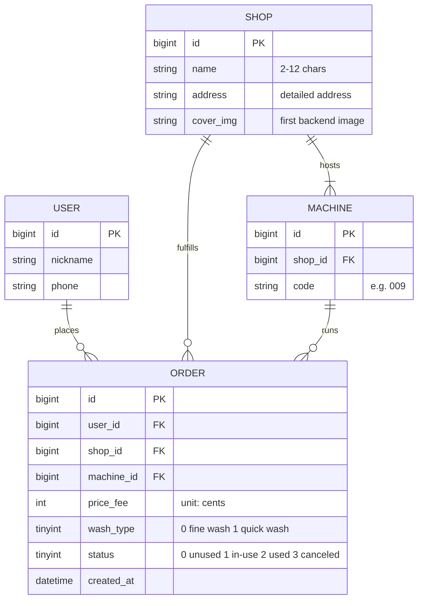
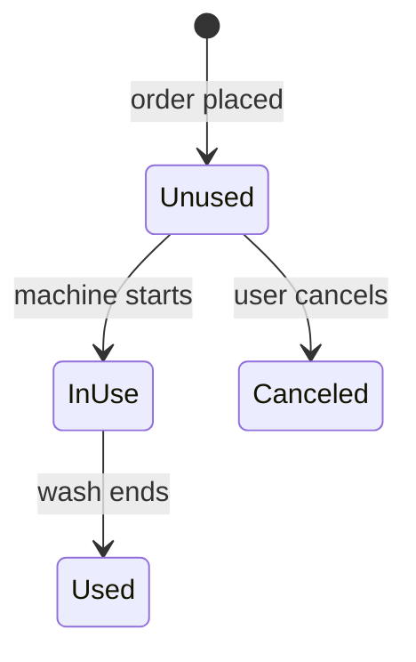

# Product Design, in Depth — Fewer questions, less guessing, less rework

This file gives, for each element of the "Product design" section, the **key writing points + copy-ready examples**. Get these right and the PRD becomes one engineers love. A single running example threads through: **the order-list page of a car-wash booking app**.

## Contents
- [1. Entity-Relationship (E-R) diagram](#1-entity-relationship-e-r-diagram)
- [2. Role-permission matrix](#2-role-permission-matrix)
- [3. Decomposing flowcharts layer by layer](#3-decomposing-flowcharts-layer-by-layer)
- [4. Global spec](#4-global-spec)
- [5. The four dimensions of a function & interaction spec](#5-the-four-dimensions-of-a-function--interaction-spec)
- [6. How to write state transitions](#6-how-to-write-state-transitions)
- [7. The abnormal-interaction checklist (most often missed)](#7-the-abnormal-interaction-checklist-most-often-missed)
- [8. Page-numbering convention](#8-page-numbering-convention)

---

## 1. Entity-Relationship (E-R) diagram

**Why**: with an E-R diagram, database engineers can design the schema without repeatedly asking "where does this field live, what does it relate to?". Whenever data is persisted, lead with one.

**How**: list entities, each entity's key fields (with type, primary/foreign keys), and the relationships between entities (1:1 / 1:n / n:m).



> Tip: for enum fields like `status` and `wash_type`, spell out the meaning of every value right in the E-R diagram or field table — it saves both engineering and QA.

## 2. Role-permission matrix

**Why**: if permission logic is scattered through the prose, you get the classic bug "a role that shouldn't see X can see X". Centralize it into one matrix — clear at a glance and easy to test.

**How**: rows are functions/data items, columns are roles, and each cell marks the permission (Yes / No / Partial, with a note).

| Function / Data | Customer | Shop staff | Ops |
|-----------------|:--------:|:----------:|:---:|
| View order detail | Own only | Own shop | Yes |
| Cancel order | While Unused | No | Yes |
| Start wash machine | Own order | Assist on-site | No |
| Delete order record | Own, after Used | No | Yes |
| Edit shop / machine info | No | Own shop | Yes |

## 3. Decomposing flowcharts layer by layer

**Core method: business flow → task flow → page flow**, from coarse to fine. Engineers first read the business flow for the big picture, then the page flow to build it.

- **Business flow**: how the whole business runs, across roles and systems.
  ```mermaid
  flowchart LR
      Book[Customer places order] --> Go[Customer goes to shop] --> Start[Wash machine starts] --> Wash[Car is washing] --> Done[Wash ends, order Used]
  ```
- **Task flow**: focus on one task, e.g. every branch of "customer cancels an order".
  ```mermaid
  flowchart TD
      A[Tap Cancel order] --> B{Order status?}
      B -->|Unused| C[Show confirm dialog] --> D{Confirm?}
      D -->|Confirm| E[Cancel order, status -> Canceled]
      D -->|Don't cancel yet| F[Return to order list]
      B -->|In use / Used| G[Not cancelable, wash already started]
  ```
- **Page flow**: how pages transition.
  ```mermaid
  flowchart LR
      List[P-01 Order list] --> Detail[P-02 Store detail] 
      List --> Machine[P-03 Start machine]
      List --> Confirm[P-01-D1 Cancel confirm dialog]
  ```

## 4. Global spec

**Why**: empty data, load failure, network error — nearly every page has these states. Writing them per page is verbose and prone to inconsistency. **Define them once** and reference them — this is the key to keeping a PRD concise.

**Shared-state list (example)**:

| Scenario | Behavior | Copy / action |
|----------|----------|---------------|
| Empty data | Centered illustration + hint | "No orders yet, go book a wash" + [Find a shop] |
| Loading | Skeleton / spinner | — |
| Load failed / network error | Centered illustration + hint | "Load failed, tap to retry" + [Retry] |
| Offline | Top banner | "No network connection" |
| No permission | Empty-state page | "No permission to view, contact your admin" |
| Request in flight | Button spinner + disabled | Prevent double submit |
| Confirm-destructive action | Center modal + two buttons | Confirm / Cancel; see per-action copy |

In the body you can then write: "when the list is empty, see [Global spec · Empty data]", with no repeated description.

## 5. The four dimensions of a function & interaction spec

> This is a compact walkthrough. This part of the PRD is the most detailed of all — for the exhaustive method (canonical table formats, the full abnormal-path taxonomy, per-component conventions, permissions and analytics per action, and a fully worked max-detail example), see `function-interaction-spec.md`.

Write every page/module across these four dimensions to plug the questions engineers would ask. Example: the order-list page (P-01).

**Dimension 1: fields, field descriptions, data sources**

| Field | Description | Data source |
|-------|-------------|-------------|
| Order date | Format: `2016-03-15 19:00` | System-determined |
| Order status | Unused / In use / Used / Canceled | System-determined |
| Car-wash spot name | 2-12 characters | Backend |
| Detailed address | 6-20 characters; single line only; if it overflows one line, the last character shows as "..." | Backend |
| Image | The first image uploaded in the backend | Backend |
| Wash type | Fine wash / Quick wash | System-determined |
| Price | e.g. `¥15`, integer | Backend |

> Writing the **data source** is the soul of this dimension: engineers need to know whether each field comes from an API/backend, is system-determined, is computed locally, or is user input.

**Dimension 2: preconditions, sort rules, load rules**

| Precondition | Sort rule | Load rule |
|--------------|-----------|-----------|
| User is logged in | 1. Sort by order status first (Unused, In use, Used); 2. Then reverse chronological order | 1. Auto-load on entering the page; 2. Load 10 historical orders per batch, pull up to load more |

**Dimension 3: state transitions** (see the next section)

**Dimension 4: interactions (normal + abnormal)** — number each line to match the wireframe annotations drawn on the page ((1), (2), (3) ...):
- (1) Tap the order card / spot name → enter the store detail page (P-02, store 008).
- (2) Tap "Cancel order" → pop a confirm dialog "Are you sure you want to cancel this order?"; tap "Confirm" → cancel the order (status → Canceled); tap "Don't cancel yet" → return to this page.
- (3) Tap "Go wash" → enter the start-machine page (P-03, machine 009).
- (4) Tap "View detail" → enter the start-machine page (P-03, machine 009).
- (5) Tap the delete (trash) icon → pop a confirm dialog "Are you sure you want to delete this order?"; tap "Confirm" → delete the order; tap "Cancel" → return to this page.
- (6) Tap "Reorder" → enter the store detail page (P-02, store 008).
- Abnormal branches: see [the abnormal checklist in section 7](#7-the-abnormal-interaction-checklist-most-often-missed).

## 6. How to write state transitions

**Why**: state is where engineers most easily misunderstand. Laying out "from which state, on what condition, to which state" as a table or diagram drops ambiguity to zero.

**State table (car-wash order) example**:

| From state | Trigger / condition | To state |
|------------|---------------------|----------|
| (start) | User places order successfully | Unused |
| Unused | Wash machine starts successfully | In use |
| In use | Wash ends | Used |
| Unused | User cancels order | Canceled |

Or a Mermaid state diagram:


## 7. The abnormal-interaction checklist (most often missed)

When writing "interactions", anyone can write the happy path; the **error paths are what separate professional from amateur**. Check each of these for coverage:

- **Empty**: no data, empty list, empty search result.
- **Error**: API error, timeout, malformed response.
- **Offline**: no network, weak network, request cut off mid-way.
- **Invalid input**: wrong format, over-length, special characters, required-but-blank.
- **Out of bounds / over-limit**: negative amount, machine occupied, quota used up, above max.
- **Permission**: session expired, no permission, banned.
- **Concurrency / timing**: double click, double submit, order already changed by someone else, state already moved.
- **Boundary values**: 0, 1, last page, last item, edge times.

Order-list page examples:
- List empty → see [Global spec · Empty data].
- Fetch failed → see [Global spec · Load failed], keep the previous data instead of clearing it.
- Tapped "Cancel order" on an order that was already started elsewhere → toast "Order status updated" and refresh the list.
- Tapped "Go wash" but machine 009 is already occupied → toast "Machine in use, please wait".
- Repeated pull-up-to-load-more → ignore new load requests while one is in flight.

## 8. Page-numbering convention

Number every page/mockup and reference the numbers in the function spec, so "PRD ↔ mockup ↔ visual design" all line up.

- Naming: `P-` + two digits, e.g. `P-01 Order list`, `P-02 Store detail`, `P-03 Start machine`. Dialogs can be `P-01-D1` (e.g. the cancel-order confirm dialog).
- Use the same numbers in function-spec headings, flowchart nodes, and mockup annotations.
- Payoff: in review, "the Go wash button on P-01" tells everyone exactly what you mean.

---

## The whole thing in one line

Answer, in the document and ahead of time, **every question an engineer would come back to ask** — where does this field come from, where does this state go next, what happens offline, can this role see it. Do that, and you have a requirements doc engineers love.
